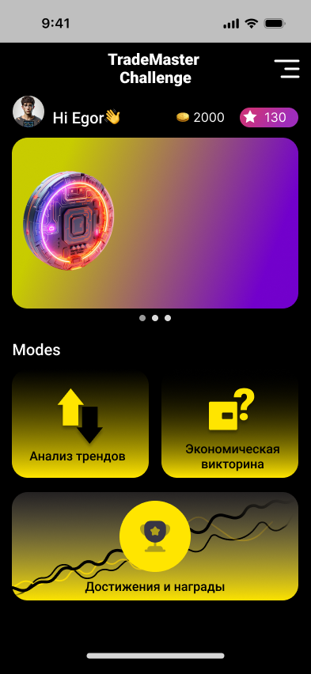
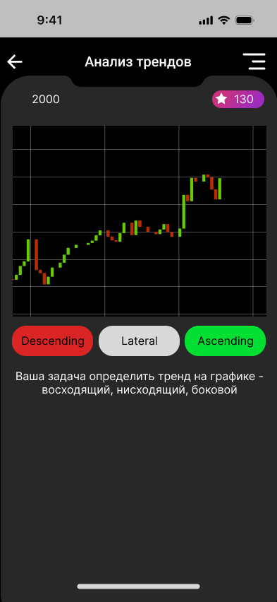
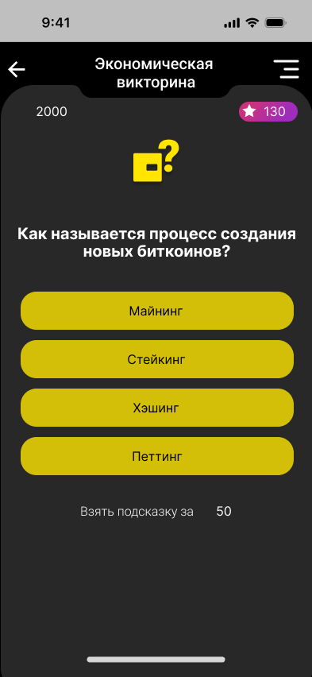
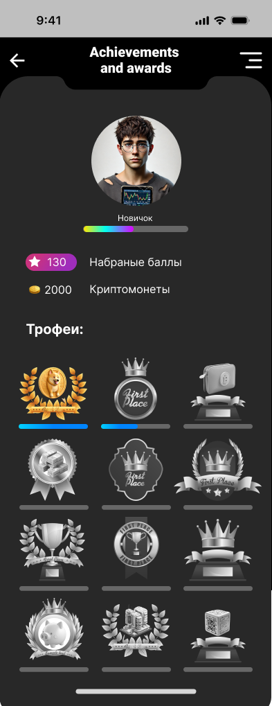
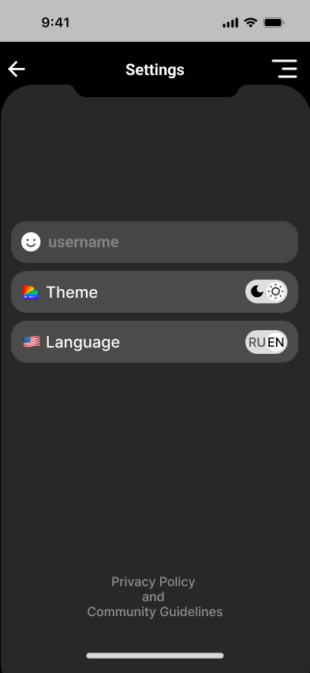

# Trading Analysis and Education App

A comprehensive trading analysis and education app that offers users a blend of interactive trend analysis, economic quizzes, achievements, and customizable settings. The app is designed for users looking to practice trading analysis skills, test their knowledge of economics, and earn virtual rewards and achievements.

## Features

### Main Menu
- Four primary modes: **"Trend Analysis"**, **"Economic Quiz"**, **"Achievements and Awards"**, and **"Settings"**.
- A greeting message and a trading-themed banner enhance the main menu's interface.

  

### Trend Analysis Mode
- Users can view charts that depict market trends (time series data).
- The goal is to identify the trend direction: upward, downward, or sideways.
- Immediate feedback on the correctness of each answer.
- Point-based system rewards correct answers, and accumulated points can be exchanged for virtual rewards and achievements.

  

### Economic Quiz Mode
- A quiz with questions on economic and financial topics.
- Questions range in difficulty, challenging both beginners and advanced users.
- Time limits are applied to each question, adding an element of urgency.
- Points are awarded for correct answers, and points earned in "Trend Analysis" can be used to purchase hints.

  

### Achievements and Awards Mode
- A dedicated section to view earned virtual awards and achievements.
- Each award and achievement comes with a description explaining how it was earned.
- Statistics showing total points earned and achievements completed.

  

### Settings
- Language selection (Russian/English).
- Theme selection (light/dark mode).
- Nickname change option.
- Additional information on awards and achievements.

  

## Virtual Rewards

The app rewards users with a variety of virtual items based on their performance and achievements:

- **Trophies**: Awarded for reaching specific goals, such as consistently analyzing trends correctly over time.
- **Medals**: Earned for achieving a streak of correct answers.
- **Bonus Points**: Extra points that can be used in quizzes or to unlock new levels of difficulty.

## Achievements

The app tracks and displays achievements, giving users clear goals to strive for:

- **Beginner**: Identify the correct trend 10 times.
- **Intermediate**: Identify the correct trend 50 times.
- **Expert**: Identify the correct trend 100 times.
- **Trend Master**: Achieve 20 correct answers in a row.
- **Analyst of the Month**: Earn the highest score of the month.

## How It Works

1. **Welcome Screen**: Users start with a welcome message or disclaimer and can move forward by tapping "Next."
  
2. **Main Menu**: Users choose between the four modes, each offering a unique way to engage with trading and economics.

3. **Trend Analysis Mode**: Users view market trend charts and predict whether the trend is upward, downward, or sideways. Immediate feedback is provided, and points are awarded for correct answers.

4. **Economic Quiz Mode**: A timed quiz challenges users' knowledge of economics and finance, with the option to use earned points for hints.

5. **Achievements and Awards Mode**: Users can view and track their progress with a detailed list of awards, trophies, and achievements.

6. **Settings**: Users can customize their experience with language options, themes, and nickname changes.

## Getting Started

1. Clone the repository and open the project in Unity.
2. Customize educational content by adding quiz questions, updating the trend analysis data, and configuring virtual rewards.
3. Build and deploy the app for iOS and Android.

## Usage

In the app, users can:

- Analyze trading trends and receive feedback on their predictions.
- Test their knowledge with economic quizzes.
- Track and earn achievements and awards for their performance.
- Adjust language, theme, and nickname settings to personalize their experience.

---

# Приложение для Анализа Торговли и Образования

Это приложение объединяет анализ торговых трендов, экономические викторины, награды и настройки, предлагая пользователям интерактивное и познавательное обучение. Оно подходит для пользователей, которые хотят улучшить свои навыки анализа торговли, проверить знания в области экономики и зарабатывать виртуальные награды.

##

## Особенности

### Главное Меню
- Четыре основных режима: **"Анализ трендов"**, **"Экономическая викторина"**, **"Достижения и награды"**, и **"Настройки"**.
- Приветственное сообщение и баннер с темой, связанной с торговлей.

  

### Режим Анализ Трендов
- Пользователи могут просматривать графики рыночных трендов (временные ряды).
- Цель — определить направление тренда: восходящий, нисходящий или боковой.
- Мгновенная обратная связь по правильности ответа.
- Система очков за правильные ответы, которые можно обменивать на виртуальные награды и достижения.

  

### Режим Экономическая Викторина
- Викторина с вопросами по экономике и финансам.
- Вопросы различной сложности, интересные как новичкам, так и продвинутым пользователям.
- Ограничение по времени на каждый вопрос, что добавляет динамику.
- Система очков за правильные ответы; очки из режима "Анализ трендов" можно использовать для покупки подсказок.

  

### Режим Достижения и Награды
- Просмотр заработанных наград и достижений.
- Описание условий получения каждой награды.
- Статистика по количеству заработанных очков и достигнутым успехам.

  

### Настройки
- Выбор языка (Русский/Английский).
- Темы (светлая/темная).
- Изменение ника.
- Дополнительные сведения о наградах и достижениях.

  

## Виртуальные Награды

Приложение предлагает пользователям различные виртуальные награды за достижения и успешные действия:

- **Трофеи**: За достижение определённых целей, таких как постоянный правильный анализ трендов.
- **Медали**: За серию правильных ответов подряд.
- **Бонусные Очки**: Дополнительные очки для использования в викторинах или разблокировки новых уровней сложности.

## Достижения

Приложение отслеживает и отображает достижения, давая пользователям цели для совершенствования:

- **Новичок**: Правильно определить тренд 10 раз.
- **Продвинутый**: Правильно определить тренд 50 раз.
- **Эксперт**: Правильно определить тренд 100 раз.
- **Мастер Трендов**: Достигнуть 20 правильных ответов подряд.
- **Аналитик Месяца**: Набрать наибольшее количество очков за месяц.

## Как Это Работает

1. **Приветственный Экран**: Пользователь видит приветственное сообщение или дисклеймер и может продолжить, нажав "Далее".
  
2. **Главное Меню**: Пользователь выбирает один из четырёх режимов, каждый из которых предлагает уникальный способ взаимодействия с торговлей и экономикой.

3. **Режим Анализ Трендов**: Пользователи анализируют рыночные графики и прогнозируют направление тренда. Система мгновенно даёт обратную связь и начисляет очки за правильные ответы.

4. **Режим Экономическая Викторина**: Викторина с таймером проверяет знания пользователей по экономике, с возможностью использовать очки для подсказок.

5. **Режим Достижения и Награды**: Пользователь может отслеживать свои награды и достижения, а также видеть свои статистики.

6. **Настройки**: Пользователи могут настраивать язык, тему и никнейм для персонализации приложения.

## Начало Работы

1. Склонируйте репозиторий и откройте проект в Unity.
2. Настройте образовательный контент, добавив вопросы викторины и обновив данные для анализа трендов.
3. Соберите и разверните приложение для iOS и Android.

## Использование

В приложении пользователи могут:

- Анализировать рыночные тренды и получать обратную связь по предсказаниям.
- Проверять знания по экономике в режиме викторины.
- Отслеживать свои достижения и награды.
- Настраивать язык, тему и никнейм для персонализации опыта.

